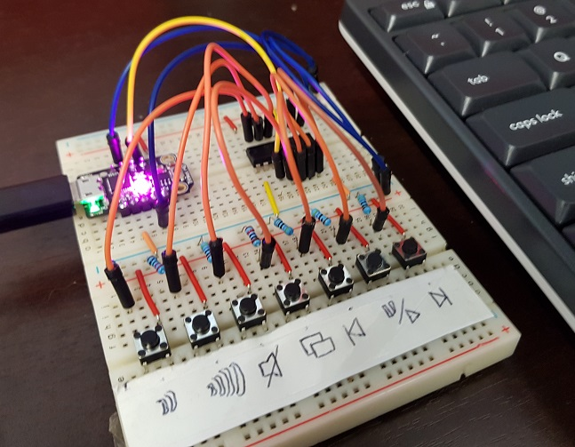
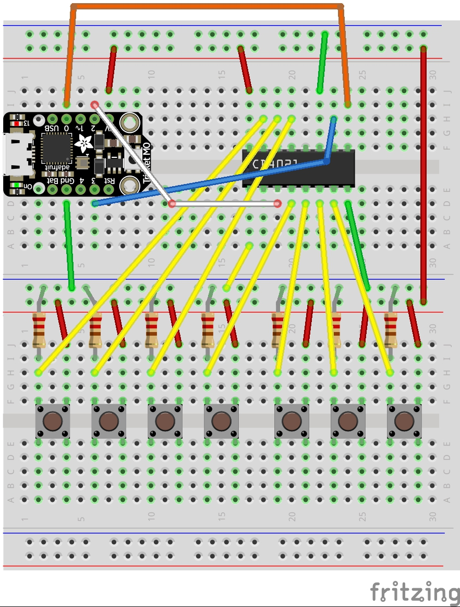

# Circuitpython-multimedia-hid

This project uses the Adafruit Trinket M0 (https://www.adafruit.com/product/3500) running CircuitPython as a HID (keyboard).  You can send both normal keypresses and multimedia commands via USB into your PC.  I have it running on my Windows10 machine to control Spotify.  As the Trinket only has a limited number of inputs I used a CMOS 4021 8x input PISO chip to let me have 8x digital inputs available to connect buttons to.  Note: You should always tie any unused CMOS input pins to ground. 

This was a fun little project that let me play with using the SimepleIO library with CMOS chips like 4021 (and 74HC595 in another project).

